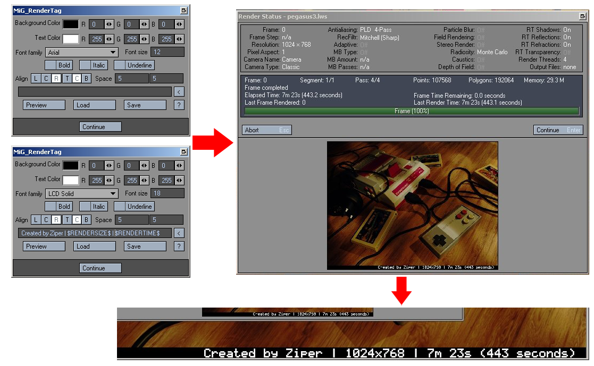

# MiG_RenderTag 
> Newtek Lightwave plugin for layout module

Image filter plugin for layout, printing on the final renderer info about the rendering time, author and resolution of the output image and any data in the form of text from the user on the final renderer.

## Installation

Windows:

>1. Copy the plugin with the **MiG_RenderTag.p** extension to the Lightwave plugins folder.
>2. Run the Layout module and add the plugin by clicking the **Add plugin** button in the **Utilities** tab, selecting the file "MiG_RenderTag.p"

## Usage example

>1. Go to the **Effects-> Processing** tab and add an **Image Filter** named **MiG_RenderTag**.
>2. Enter the filter settings and then complete the content of the component located above the Preview \ Load \ Save buttons by adding any text, eg "Sample Render Tag".
>3. Close the dialog box by clicking the **Continue** button
>4. Render a single frame by pressing **F9**.
>5. Done!

In the rendered image you will see a black rectangle at the bottom with a white inscription "Sample Render Tag".

## Development setup

Describe how to install Lightwave 3D SDK and prepare the environment for building a plugin.

Description for the Visual Studio development environment:

> ### Build server.lib for Lightwave SDK:
>1. Download the official SDK for Ligthwave 3D from the manufacturer's website:
https://www.lightwave3d.com/lightwave_sdk/
>2. Unzip the SDK package to the location where the plugin project is located in the **"sdk\lwsdk"** folder
>3. Open the solution file in visual studio located in the main lwsdk folder
>4. Switch to the active project called **source**
>5. Select the target platform (for Lightwave plugins in 32 bit version use win32 and for Lightwave in 64 bit version use win64) and configuration type (Release or Debug)
>6. Access the project settings in the **Librarian** tab
>7. Set *Output File* to **$(OutDir)\server.lib**
>8. Build a project.
>9. Done!

> ### Build MiG_RenderTag plugin:
If the process of building server.lib was successful then follow these steps:

>1. After creating a copy of the repository, also download the simpleini submodule
>2. Go to the project folder and open the Visual Studio walkthrough called MIG_Plugin
>3. Select the target platform (for Lightwave plugins in 32 bit version use win32 and for Lightwave in 64 bit version use win64) and configuration type (Release or Debug)
>4. Optionally, if you want to debug the plugin while the layout module is running, then in the project settings go to the **Debugging** tab and set as **Command** the full path to the exek files of the layout module. 
> In addition, set the **Command Arguments** parameter if you want to run the layout module with your own parameters
>5. Build a project.
>6. Done!

## Release History

* 0.6.1
    * Initial Commit

## Meta

Distributed under the MIT license. See ``LICENSE`` for more information.

## Contributing

1. Fork it (<https://github.com/michalgolek/Lightwave-Plugin-ImageFilter_RenderTag/fork>)
2. Create your feature branch (`git checkout -b feature/fooBar`)
3. Commit your changes (`git commit -am 'Add some fooBar'`)
4. Push to the branch (`git push origin feature/fooBar`)
5. Create a new Pull Request